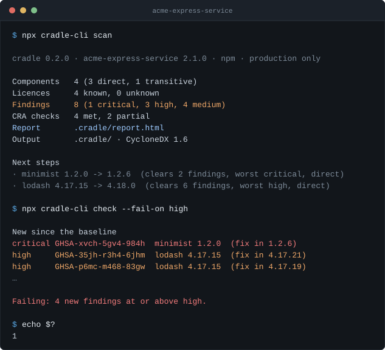

<div align="center">

# cradle

**A CycloneDX SBOM, the vulnerabilities that apply to it, and one HTML report you can send to an auditor — from a single command in any npm project.**

[](https://www.npmjs.com/package/cradle-cli)
[](https://github.com/P-hinn/cradle-cli/actions/workflows/ci.yml)
[](https://github.com/P-hinn/cradle-cli/actions/workflows/codeql.yml)
[](https://scorecard.dev/viewer/?uri=github.com/P-hinn/cradle-cli)
[](LICENSE)
[](#requirements)
[](https://cyclonedx.org/)
[](https://github.com/openvex/spec)
[](#requirements)
[](#what-it-does-not-do)



</div>

---

## Quickstart

```bash
cd your-project
npx cradle-cli
```

Three files land in `.cradle/`:

| File | What it is |
| :-- | :-- |
| **`report.html`** | One self-contained page. No external requests, prints cleanly, sends by email |
| **`sbom.cdx.json`** | CycloneDX 1.6, with real dependency edges rather than a flat list |
| **`findings.json`** | Known vulnerabilities, each with the route from your product to it |

Three more appear when you ask for them: `sbom.spdx.json`, `vex.csaf.json`, and
`vex.json` once you suppress something.

No configuration, no account, no sign-up. The only network call is the
vulnerability lookup, and `--offline` removes that one too.

Works with **npm**, **pnpm**, **Yarn Classic** and **Yarn Berry** — all read from
the lockfile, all producing the same graph for the same dependencies.

---

## Why this exists

The EU Cyber Resilience Act, [Regulation (EU) 2024/2847][cra], arrives in stages:

| Date | What starts applying |
| :-- | :-- |
| 11 June 2026 | Chapter IV — notification of conformity assessment bodies |
| **11 September 2026** | **Article 14 — reporting obligations** |
| **11 December 2027** | **Full application** |

Two things are worth getting right about what that actually means.

> **The SBOM requirement is smaller than people say.**
> Annex I, Part II(1) asks for a bill of materials "in a commonly used
> machine-readable format covering at the very least the top-level dependencies".
> Transitive dependencies are not legally required. It belongs to the technical
> documentation, is kept for ten years, and is shown to market surveillance
> authorities on request — **there is no obligation to publish it.**
> cradle records the whole tree anyway, because triage under a 24-hour clock does
> not work without it. That is our argument, not the legislator's.

> **The reporting duty is not one deadline, it is three.**
> Article 14: an early warning within **24 hours** of becoming aware, a
> vulnerability notification within **72 hours**, and a final report within
> **14 days of a corrective or mitigating measure becoming available** — note
> which clock that last one runs on. All of it to the ENISA single reporting
> platform *and* your national CSIRT, simultaneously.

Container images have had good tooling for years. npm projects have SBOM
generators, and then you are on your own for the part that takes the time:
keeping it current, deciding which findings apply to you, and writing that
decision down somewhere an auditor can read it.

> **Not everyone reading this is in scope.** The CRA covers products with digital
> elements placed on the EU market. Open-source development outside a commercial
> activity is largely out of scope, and "open-source software stewards" have
> lighter obligations under Article 24.

---

## What it does

| | |
| :-- | :-- |
| 🌳 **A real dependency graph** | `ms` hangs off `debug`, not off your root. That is the difference between an SBOM and a text file. |
| 🧭 **Findings with a route** | `acme-widget › express › body-parser` tells you whether this is an upgrade you can make, or one you have to ask someone else for. |
| 🔢 **CVSS computed, not copied** | The v3 base score is calculated from the vector. Every finding records whether its severity came from that or from the advisory's own rating — and the report says which. |
| 🗂️ **VEX that survives review** | An OpenVEX statement with one of the five standard justifications, attributed and dated, in a file you commit. |
| 📉 **A baseline, so the gate is adoptable** | Every real project has a backlog. `cradle check` reports what is *new*. |
| ✅ **A CRA readiness checklist** | The documentation and process questions, not just the packages. Where cradle cannot tell, it says so rather than guessing. |
| 🎯 **Triage by exploitation, not only severity** | EPSS and the CISA KEV catalogue. A medium somebody is actually exploiting outranks a critical nobody has touched — `check --sort exploit` says so. |
| 🇩🇪 **Built for the German and EU case** | A BSI TR-03183-2 profile, CSAF, Article 14 drafts and a German report. [See below.](#for-german-and-eu-teams) |
| 🪶 **Four runtime dependencies** | Six including transitives. For a tool about the size of dependency trees, that felt like the minimum standard of care. |

### What it does not do

Deliberately, so you know it is a decision and not a gap:

- Any ecosystem other than npm — no Python, no Go, no container images
- Signed attestations, Sigstore, SLSA. The npm publish carries a provenance
  attestation; cradle signs nothing of yours
- A web interface or a hosted service
- Automatic update pull requests — Dependabot and Renovate do that better
- Licence policy enforcement. Licences are shown, never blocked on
- Deciding whether a vulnerability is being **actively exploited**, or whether you
  owe anyone a report. cradle shows the signals and drafts the paperwork; the
  determination is yours
- **Telemetry.** Not now, not later

SPDX **used to be on this list** and no longer is: `--sbom-format spdx` writes
SPDX 2.3 JSON from the same graph. It is a second rendering, not a second
opinion — a test counts the dependency edges in both documents and requires them
to match.

---

## In CI

```yaml
name: cradle
on: [pull_request]

permissions:
  contents: read
  pull-requests: write   # only needed for comment-on-pr

jobs:
  sbom:
    runs-on: ubuntu-latest
    steps:
      - uses: actions/checkout@v5
      - uses: actions/setup-node@v5
        with:
          node-version: '22'
      - run: npm ci
      - uses: P-hinn/cradle-cli@v0.1.3
        with:
          fail-on: high
          upload-artifact: true
          comment-on-pr: true
```

The action scans, checks against the baseline, uploads the report as a build
artifact, and **edits one pull-request comment in place** rather than adding a
new one on every push.

For GitLab, [`examples/gitlab-ci.yml`](examples/gitlab-ci.yml) does the same
three things — evidence, gate, merge-request comment — and feeds the Security
dashboard through `check --format sarif`.

Pin the exact tag while the project is pre-1.0. The action's default
`cradle-cli` version is the release it was cut from, so a pinned tag means a
pinned tool. A moving `v1` will exist once there is a 1.0 worth moving.

Exit codes are part of the contract:

| Code | Meaning |
| :-- | :-- |
| `0` | Nothing new above the threshold |
| `1` | New findings above the threshold |
| `2` | cradle could not run |

The difference between `1` and `2` is the point. **A broken tool must never read
as a security result.**

### Adopting the gate on a project that already has a backlog

A gate that is red on day one gets switched off. So accept what is there today:

```bash
npx cradle-cli check --baseline
```

Commit `.cradle/baseline.json`. From then on `cradle check` reports only what is
new.

A finding is identified by advisory and package **name, without the version** —
bumping a still-vulnerable dependency is not news, and a gate that reddens on
unrelated churn is a gate nobody trusts. The severity you accepted is recorded
too: if an advisory is later re-rated *worse*, it counts as new again.

---

## Suppressing a finding you have actually looked at

The daily pain is not "I cannot find vulnerabilities". It is drowning in findings
that do not apply to you.

```bash
npx cradle-cli suppress CVE-2021-44906 \
  --justification vulnerable_code_not_in_execute_path \
  --note "Only our own CI wrapper parses argv here; no untrusted input reaches minimist." \
  --expires 2027-03-31
```

That writes an [OpenVEX][openvex] statement into `.cradle/vex.json`:

```json
{
  "@context": "https://openvex.dev/ns/v0.2.0",
  "author": "you@example.com",
  "statements": [
    {
      "vulnerability": { "name": "GHSA-xvch-5gv4-984h", "aliases": ["CVE-2021-44906"] },
      "products": [{ "@id": "pkg:npm/minimist@1.2.0" }],
      "status": "not_affected",
      "justification": "vulnerable_code_not_in_execute_path",
      "status_notes": "Only our own CI wrapper parses argv here; …",
      "cradle:expires": "2027-03-31"
    }
  ]
}
```

The category is mandatory, and only the five [OpenVEX][openvex] defines are
accepted:

| Justification | Means |
| :-- | :-- |
| `component_not_present` | The vulnerable component is not in the delivered product |
| `vulnerable_code_not_present` | The component is there, the vulnerable code is not |
| `vulnerable_code_not_in_execute_path` | The vulnerable code is there but never runs |
| `vulnerable_code_cannot_be_controlled_by_adversary` | It runs, but an attacker cannot reach or influence it |
| `inline_mitigations_already_exist` | Existing mitigations already prevent exploitation |

That is deliberately a little inconvenient. The category is what makes a
suppression something a reviewer can **disagree with**, rather than a silent
dismissal. Your free text goes alongside it, not instead of it.

Suppressed findings stay in the report, in their own section, with the reason.
Hiding them would defeat the point.

`--expires` is a cradle extension — OpenVEX has no notion of expiry, so it is
written as `cradle:expires`. When it lapses the finding comes back, carrying the
note that its ruling expired. A decision about a dependency should have to be
renewed, not quietly outlive its reasoning.

> **Know what that costs.** OpenVEX has no extension point: its
> [JSON Schema][openvex-schema] sets `additionalProperties: false` on a statement.
> So a strict validator does not *ignore* `cradle:expires` — it rejects the whole
> document. Remove that one key and the file validates exactly, and a test pins
> both halves of that. If you need a file that passes validation as-is, leave
> `--expires` off; the trade is an expiry date against strict conformance, and it
> is yours to make, not ours.

---

## What belongs in git

```gitignore
**/.cradle/*
!**/.cradle/config.json
!**/.cradle/vex.json
!**/.cradle/baseline.json
```

The three exceptions record **decisions**. The rest is output, regenerated on
every run.

Two details that cost us an afternoon, so they need not cost you anything: the
negations need `.cradle/*` rather than `.cradle/`, because git cannot re-include
a file whose parent directory is excluded — and the `**/` matters in a monorepo,
because a pattern containing a slash is anchored to the directory its
`.gitignore` sits in. A blanket `.cradle/` silently drops the files holding your
own rulings.

---

## Configuration

Entirely optional. `.cradle/config.json` answers the questions cradle cannot work
out from your code:

```json
{
  "productName": "Acme Widget",
  "contactEmail": "security@acme.example",
  "placedOnMarket": "2026-01-15",
  "supportPeriodEnd": "2031-01-15"
}
```

`placedOnMarket` is what lets the readiness check actually test the five-year
support floor, instead of only noting that a date exists.

An unknown key is an error rather than a no-op: a misspelt `supportPeriodEnd`
would otherwise leave the check reporting "not documented" while you are certain
you documented it.

---

## Compared with the alternatives

Not a scoring table. They solve different problems, and for several of these the
honest answer is "use that one instead".

| | Scope | Where cradle differs |
| :-- | :-- | :-- |
| **[Syft][syft] / [Grype][grype]** | Many ecosystems, container-first | The right answer for images and polyglot repositories, and far wider than cradle will ever be. cradle only knows npm, and spends that narrowness on the report and the checklist. |
| **[Trivy][trivy]** | Images, filesystems, IaC, secrets | A broad security scanner with an SBOM mode. cradle is an SBOM and documentation tool with a vulnerability lookup. Different centre of gravity. |
| **[cdxgen][cdxgen]** | CycloneDX for many languages | Richer, more configurable SBOMs across far more ecosystems. cradle produces a narrower one and then does something with it. |
| **[@cyclonedx/cyclonedx-npm][cdxnpm]** | CycloneDX for npm | The closest comparison, actively maintained, and good at its job. **If an SBOM file is all you need, use it.** cradle exists for what comes after: findings with a route, VEX, a baseline, a readiness checklist, and a report you can hand to someone. |
| **`npm audit`** | Built in, nothing to install | Fast and free, but no SBOM, no VEX, no baseline, and nothing to send to an auditor. |

SBOM generation is table stakes. The difference is everything after it.

---

## For German and EU teams

The rest of this README applies everywhere. This part is for the case cradle was
built around: a manufacturer placing a product on the EU market, being asked for
evidence in a particular shape.

### The BSI SBOM guideline, checked field by field

```bash
npx cradle-cli check --profile bsi-tr-03183
```

Eighteen data fields from [BSI TR-03183-2][bsi] **version 2.1.0** (20 August
2025), each citing the section it comes from and the place the guideline's own
mapping table puts it in CycloneDX 1.6. It appears as its own report section, and
in `--format github` and `--format markdown`.

It **never changes the exit code.** Several fields the guideline requires are
statements about your delivery — whether the artefact you ship is executable, an
archive, a structured file — and an npm package is fetched as a `.tgz` and
installed as a directory, so which of those you ship is not in your lockfile.
Those come back `not assessable` with the reason. A build that is permanently red
gets switched off, and a checklist nobody can satisfy is worth nothing.

The only verdict it will give is **"no required field is open"**. Not
"compliant" — that word appears nowhere in the profile, and a test keeps it that
way.

### CSAF, SPDX and a German report

```bash
npx cradle-cli scan --vex-format both --sbom-format both --lang de
```

| Flag | What you get |
| :-- | :-- |
| `--vex-format csaf` | `vex.csaf.json` — CSAF 2.0 in the VEX profile, from the same suppressions as `vex.json`. CSAF's `flags[].label` enumerates exactly the five OpenVEX justifications, so nothing is lost in translation |
| `--sbom-format spdx` | `sbom.spdx.json` — SPDX 2.3, same graph, same timestamp, the CycloneDX serial number in its namespace |
| `--lang de` | The report and the pull-request comment in German, with `lang="de"` set. The terminology follows the German text of the regulation: *Schwachstelle*, *Komponente*, *Begründung*, *Unterstützungszeitraum* |

Both exports validate against their official schemas. A file that claims a format
and does not meet it is worse than no file.

### Article 14 reporting drafts

From **11 September 2026**, Article 14 is three obligations with three clocks.

```bash
npx cradle-cli notify GHSA-xvch-5gv4-984h --stage early-warning
```

| Stage | Deadline | From |
| :-- | :-- | :-- |
| `early-warning` | 24 hours | becoming aware |
| `notification` | 72 hours | becoming aware |
| `final` | 14 days | **a corrective or mitigating measure becoming available** — not from becoming aware |

Each draft carries the content its paragraph asks for, filled in from the scan:
the component, its version, the route through your tree, the advisory and its
aliases, the fix where there is one. Everything a lockfile cannot answer — the
Member States the product is placed on, any malicious actors, the version of
*your* product that carries the fix — is a visible `[TO BE COMPLETED]`
placeholder, and the console counts them.

> **cradle does not decide that you owe a report, and it never submits one.**
> Article 14 is about *actively exploited* vulnerabilities. cradle knows an
> advisory exists and that your lockfile resolves the affected version. Whether
> anyone is exploiting it is not something a dependency scanner can know. The
> determination is yours; this writes a file.

### Triage by exploitation

```bash
npx cradle-cli check --sort exploit
```

[EPSS][epss] estimates the probability of exploitation in the next 30 days. The
[CISA KEV][kev] catalogue is evidence that it is already happening. Both appear
as a column in the report and a line in `check`, and this ordering puts
known-exploited first — a medium CISA has evidence about ahead of a critical
nobody has touched, which is the opposite of what sorting by severity says.

**`--fail-on` stays CVSS-based.** A gate whose threshold moves daily with
somebody else's model goes red overnight for reasons nobody on your team changed.
These order the work; the threshold decides what blocks. `--no-priority` turns
them off without going fully offline, and only CVE identifiers are ever sent —
no package name, no version, nothing about your project.

---

## Commands

```
cradle scan      [path] [--include-dev] [--offline] [--no-cache] [--no-priority]
                        [--spec-version 1.6|1.7] [--sbom-format cyclonedx|spdx|both]
                        [--vex-format openvex|csaf|both] [--lang en|de]
                        [--workspace <name|all>] [--profile bsi-tr-03183]
                        [--timestamp <iso>] [--serial-number <urn>]
                        [--output-dir <dir>]
cradle check     [path] [--fail-on <severity>] [--baseline] [--no-baseline]
                        [--format text|github|markdown|sarif] [--sort severity|exploit]
                        [--workspace <name>] [--profile bsi-tr-03183] [--lang en|de]
                        [--artifact-name <name>] [--no-priority] [--output-dir <dir>]
cradle suppress  <advisory-id> [path] --justification <category>
                        [--component <purl>] [--note "…"] [--expires <date>]
cradle notify    <advisory-id> [path] --stage early-warning|notification|final
                        [--output <file>]
```

`cradle <command> --help` prints the rest.

### Monorepos

```bash
npx cradle-cli scan --workspace all
```

One report per package, written into that package's own directory, with the
package as the product and only its own dependencies in it. The route starts
where a team can act on it: `@acme/api › fastify › find-my-way` rather than
`acme-monorepo › @acme/api › fastify › find-my-way`.

The per-package graph is **sliced out of the repository-wide one**, never
resolved separately — a monorepo has one lockfile and therefore one resolution,
and two reports about the same code that disagree are worse than one.

`cradle check --workspace <name>` gates a single package, with its baseline in
that package's directory, so a sibling's backlog no longer reddens your gate.
`check --workspace all` is deliberately refused: a gate has one exit code and one
pull-request comment, and neither can honestly speak for several packages.

### Reproducible output

```bash
npx cradle-cli scan --timestamp 2026-09-26T12:00:00Z --serial-number urn:uuid:…
```

Two runs over the same lockfile with the same values produce byte-identical
`sbom.cdx.json`, `findings.json` and `report.html`. The defaults stay as they
are — a report should say when it was made, and a fresh serial number is what
lets a reader tell two BOMs apart.

## Using it as a library

```ts
import { resolveNpm, buildBom } from 'cradle-cli'

const graph = await resolveNpm({ projectDir: process.cwd(), includeDev: false })
const bom = buildBom(graph, {
  specVersion: '1.6',
  timestamp: new Date().toISOString(),
  serialNumber: `urn:uuid:${crypto.randomUUID()}`,
})
```

Everything under `core/` takes its input as arguments and returns values. It
reads a lockfile where it must, but never writes files and never prints. File
access and output live in the CLI layer.

## Requirements

**Node.js 22.9 or newer.** Node 20 reached end of life in April 2026, and a
security tool has no business running on an unsupported runtime.

Four runtime dependencies — [`packageurl-js`][purl], [`semver`][semver],
[`spdx-expression-parse`][spdx] and [`yaml`][yaml] — six including transitives.
They are deliberately **not bundled**, so a security fix in any of them reaches
you without waiting for a cradle release.

## Try it

[`examples/express-service`](examples/express-service) is a project pinned to
deliberately dated dependencies, with a lockfile, a `SECURITY.md`, a config and a
workflow — and no `node_modules`, because cradle reads the lockfile.

```bash
git clone https://github.com/P-hinn/cradle-cli
cd cradle-cli/examples/express-service
npx cradle-cli scan && open .cradle/report.html
```

## What cradle does on your machine

Reads your lockfile and `node_modules` manifests, writes to `.cradle/`, and talks
to `api.osv.dev`, `registry.npmjs.org`, `api.first.org` (EPSS) and `www.cisa.gov`
(the Known Exploited Vulnerabilities catalogue) — all skipped by `--offline`, and
the last two by `--no-priority`. The two exploitation sources receive **only CVE
identifiers**: no package name, no version, nothing about your project. It runs
`git config --get user.email` once, in `cradle suppress`, to know who is
recording a decision; `--author` avoids even that. No telemetry.
[`SECURITY.md`](SECURITY.md) has the full table.

## Releasing

Tagging is the whole process:

```bash
npm version patch   # or minor - writes package.json and creates the tag
git push --follow-tags
```

`.github/workflows/release.yml` takes it from there: it refuses a tag that
disagrees with `package.json`, runs the full gate, publishes to npm **with a
provenance attestation**, scans cradle with cradle, and opens a GitHub release
carrying the changelog section for that version and cradle's own SBOM as an
asset. A tool that asks people to keep an SBOM should ship one.

The attestation is why publishing happens in CI rather than from a laptop: it is
cryptographic proof that a given tarball was built from a given commit by a given
workflow. Publishing by hand produces a package that is fine and proves nothing.

**A published version is final; tags do not move.** A re-run skips the publish
when the version is already on the registry, and compares npm's recorded
`gitHead` against the commit being built — if they differ it stops rather than
attaching an SBOM and a report describing one commit to a tarball built from
another. For a tool whose subject is supply-chain evidence, that is the worst
available outcome, because it looks green.

**One-time setup** on npmjs.com, under the package's *Settings → Trusted
Publisher*: GitHub Actions, repository `P-hinn/cradle-cli`, workflow
`release.yml`. That removes the need for a token entirely — worth doing before
January 2027, when npm restricts tokens that bypass 2FA. Without it, set an
`NPM_TOKEN` secret instead; the workflow accepts either.

## Contributing

Issues and pull requests welcome. [`CONTRIBUTING.md`](CONTRIBUTING.md) has the
setup, the four commands that make up the gate, and how to add a lockfile
fixture — which is the most useful contribution there is, because a lockfile
shape cradle gets wrong is a bug report with a fix attached.

[`SPEC.md`](SPEC.md) is the working specification — what was decided, and why —
and is worth reading before changing behaviour. It is in German; this README is
authoritative for users.

Security reports go through [`SECURITY.md`](SECURITY.md), not the issue tracker.
Everyone taking part is covered by the
[Code of Conduct](CODE_OF_CONDUCT.md).

Every push and pull request runs the full gate on Node 22 and 24 across Linux,
macOS and Windows, then scans the example project with the freshly built CLI.
CodeQL and OpenSSF Scorecard run alongside it — for a tool whose subject is
supply-chain evidence, publishing its own score is the least it can do.

---

## Legal note

cradle is a technical aid for documentation and process. **It is not legal
advice, not a conformity assessment, and not a declaration of conformity.**
Whether a product meets Regulation (EU) 2024/2847 is not something this or any
tool decides. The harmonised standards for the CRA are not final at the time of
writing.

Nothing cradle produces makes anyone compliant. It makes it easier to show what
you shipped and what you decided about it — which is the tedious part, not the
hard part.

## Licence

[Apache-2.0](LICENSE).

[cra]: https://eur-lex.europa.eu/eli/reg/2024/2847/oj/eng
[openvex]: https://github.com/openvex/spec
[openvex-schema]: https://github.com/openvex/spec/blob/main/openvex_json_schema.json
[syft]: https://github.com/anchore/syft
[grype]: https://github.com/anchore/grype
[trivy]: https://github.com/aquasecurity/trivy
[cdxgen]: https://github.com/CycloneDX/cdxgen
[cdxnpm]: https://github.com/CycloneDX/cyclonedx-node-npm
[bsi]: https://bsi.bund.de/dok/TR-03183-en
[epss]: https://www.first.org/epss/
[kev]: https://www.cisa.gov/known-exploited-vulnerabilities-catalog
[purl]: https://github.com/package-url/packageurl-js
[semver]: https://github.com/npm/node-semver
[spdx]: https://github.com/jslicense/spdx-expression-parse.js
[yaml]: https://github.com/eemeli/yaml
